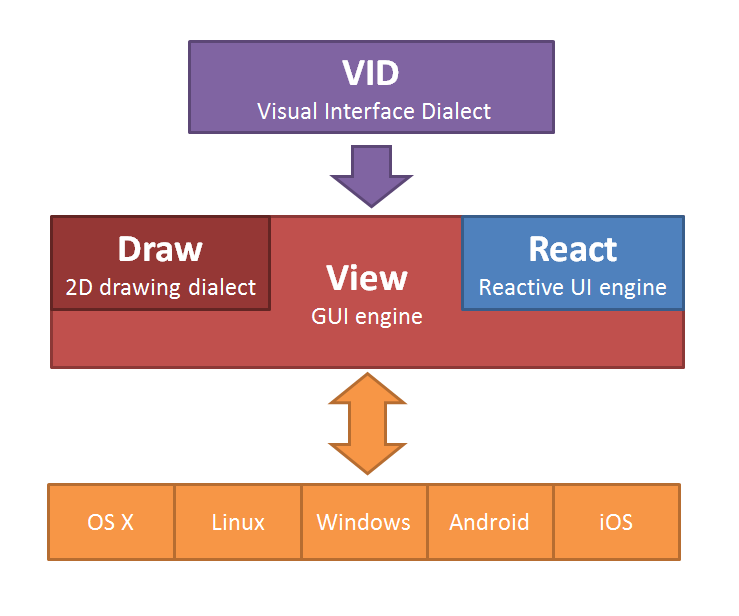

Red GUI Architecture

VID
---
VID stands for Visual Interface Dialect, it is a dialect of Red, allowing to specify graphic components with their properties, layouts and even event handlers, in the simplest possible way. VID code is compiled at runtime to a tree of faces suitable for displaying.

View 
----
The GUI code engine contains several parts:
* Platform-independent faces management engine
* Reactive actions events
* Draw dialect interpreter
* Platform backends

React
-----
The reactive actions can be defined directly in VID (with automatic attachement to nearest face) or can be specified directly using the REACT function.

Draw
----
Draw is a Red dialect for 2D vector drawing. It can be specified in different ways:
* in VID layouts
* directly in `draw` property of any face object
* using the DRAW function to draw directly onto an image

OS-specific backends
--------------------

An internal API allows to implement as many backends as required for the View engine. The backend needs to be capable of extensive 2D drawing for complete support of Draw dialect.

***
Disclamer

VID, Draw and most of View design (except for the reactive parts) were created by Carl Sassenrath in Rebol. Red makes a new implementation of them, with some improvements when desirable and possible.