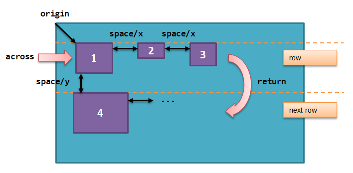
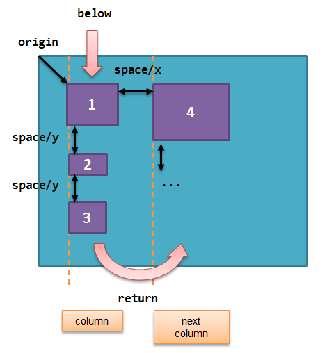

Table of Content:
* [Overview](#overview)
* [Code structure](#code-structure)
* [Panel settings](#panel-settings)
  * [title](#title)
  * [size](#size)
  * [backdrop](#backdrop)
* [Layout](#layout)
  * [across](#across)
  * [below](#below)
  * [return](#return)
  * [space](#space)
  * [origin](#origin)
  * [at](#at)
  * [pad](#pad)
  * [do](#do)
* [Faces definition](#faces-definition)
  * [Keywords](#keywords)
    * [left](#left)
    * [center](#center)
    * [right](#right)
    * [top](#top)
    * [middle](#middle)
    * [bottom](#bottom)
    * [bold](#bold)
    * [italic](#italic)
    * [underline](#underline)
    * [extra](#extra)
    * [data](#data)
    * [draw](#draw)
    * [font](#font)
    * [para](#para)
    * [wrap](#wrap)
    * [no-wrap](#no-wrap)
    * [font-size](#font-size)
    * [font-color](#font-color)
    * [font-name](#font-name)
    * [react](#react)
    * [loose](#loose)
    * [all-over](#all-over)
    * [hidden](#hidden)
    * [disabled](#disabled)
  * [Datatypes](#datatypes)
  * [Actors](#actors)
* [Styling](#styling)
  * [style](#style)
  
# Overview

VID stands for Visual Interface Dialect. Its purpose is to provide a simple dialect (DSL) for describing graphic user interfaces on top of the Red [View](https://github.com/red/red/wiki/Red-View-Graphic-System) engine.

VID allows you to specify each graphic component to display, giving the choice of different layout methods:
* horizontal or vertical flowing
* grid positioning
* absolute positioning

VID will create a container face for you automatically, to hold the faces description you provide. By default, the container face is of type `window`.

VID code is processed by the `layout` function (which is internally called by `view` function). The VID code is then compiled to a tree of faces, suitable for direct display.

_Note_: use `help view` and `help layout` from Red's console to see how to process a VID block.

# Code structure

Typical VID block of code has the following structure:

	[
	    <panel settings>
	    <layout description>
	]

* **panel settings**: settings which affect the container object (could be a panel or a window).

* **layout description**: layout positionning commands, styles definition and faces description.

_Note_: All sections are optional, there is no mandatory content to provide in a VID block.

# Panel settings

## title

**Syntax**

    title <text>
    
    <text> : title text (string!).
    
**Description**

Sets the title text of the container face.

***
## size

**Syntax**

    size <value>
    
    <value> : width and height in pixels (pair!).
    
**Description**

Sets the size of the container face.

***
## backdrop

**Syntax**

    backdrop <color>
    
    <color> : name or value of a color (word! tuple!).
    
**Description**

Sets the background color of the container face.

# Layout

By default, VID places the faces in the container face according to simple rules:

* direction can be horizontal or vertical
* faces are positioned after each other in the current direction using the current spacing

Defaults:
* origin: `10x10`
* space: `10x10`
* direction: `across`

This is how faces are laid out in `across` mode:

This is how faces are laid out in `below` mode:

***
## across

**Syntax**

    across
    
**Description**

Sets the layout direction to horizontal, from left to right.

***
## below

**Syntax**

    below
    
**Description**

Sets the layout direction to vertical, from top to bottom.

***
## return

**Syntax**

    return
    
**Description**

Returns the position to the next row or column of faces, depending of the current layout direction.

***
## space

**Syntax**

    space <offset>
    
    <offset> : new spacing value (pair!).
    
**Description**

Sets the new spacing offset which will be used for placement of following faces.

***
## origin

**Syntax**

    origin <offset>
    
    <offset> : new origin value (pair!).
    
**Description**

Sets the new origin position, relative to container face.

***
## at

**Syntax**

    at <offset>
    
    <offset> : position of next face (pair!).
    
**Description**

Places the next face at an absolute position. This positioning mode only affects the next following face, and does not change the layout flow position. So, the following faces, after the next one, will be placed again in the continuity of the previous ones in the layout flow.

***
## pad

**Syntax**

    pad <offset>
    
    <offset> : relative offset (pair!).
    
**Description**

Modifies the layout current position by a relative offset. All the following faces on the same row (or column) are affected.

***
## do

**Syntax**

    do <body>
    
    <body> : code to evaluate (block!).
    
**Description**

Evaluates a block of regular Red code, for last-minute initialization needs.

***

# Faces definition

A face can be inserted in the layout, at the current position, by just using the name of an existing face type or one of the available styles.

**Syntax**

	<name> <options>
	
	<name>    : a valid face type or style name (word!).
	<options> : optional list of options.
	
Default values are provided for each face type or style, so a new face can be used without having to specify any option. When options are required, the following sections are describing the different types of accepted options:

* Keywords
* Datatypes
* Actors

All options can be specified in arbitrary order, following the face or style name. A new face name or a layout keyword marks the end of the options list for a given face.

## Keywords

### left

**Syntax**

    left
    
**Description**

Aligns the face's text to left side.

***
### center

**Syntax**

    center
    
**Description**

Centers the face's text.

***
### right

**Syntax**

    right
    
**Description**

Aligns the face's text to right side.

***
### top

**Syntax**

    top
    
**Description**

Align vertically the face's text to `top`.

***
### middle

**Syntax**

    middle
    
**Description**

Align vertically the face's text to `middle`.

***
### bottom

**Syntax**

    bottom
    
**Description**

Align vertically the face's text to `bottom`.

***
### bold

**Syntax**

    bold
    
**Description**

Sets the face's text style to `bold`.

***
### italic

**Syntax**

    italic
    
**Description**

Sets the face's text style to `italic`.

***
### underline

**Syntax**

    underline
    
**Description**

Sets the face's text style to `underline`.

***
### extra

**Syntax**

    extra <value>
    
    <value> : any value (any-type!).
    
**Description**

Sets the face's `extra` facet to a new value.

***
### data

**Syntax**

    data <list>
    
    <list> : list of items (block!).
    
**Description**

Sets the face's `data` facet to a list of values. Format of the list depends on the face type requirements.

***
### draw

**Syntax**

    draw <commands>
    
    <commands> : list commands (block!).
    
**Description**

Sets the face's `draw` facet to a list of Draw dialect commands. See [Draw dialect](https://github.com/red/red/wiki/Draw-dialect) documentation for valid commands.

***
### font

**Syntax**

    font <spec>
    
    <spec> : a valid font specification (block! object! word!).
    
**Description**

Sets the face's `font` facet to a new `font!` object. Font! object is described [here](https://github.com/red/red/wiki/Red-View-Graphic-System#font-object).

_Note_: It possible to use `font` along with other font-related settings, VID will merge them together, giving priority to the last one specified.

***
### para

**Syntax**

    para <spec>
    
    <spec> : a valid para specification (block! object! word!).
    
**Description**

Sets the face's `para` facet to a new `para!` object. Para! object is described [here](https://github.com/red/red/wiki/Red-View-Graphic-System#para-object).

_Note_: It possible to use `para` along with other para-related settings, VID will merge them together, giving priority to the last one specified.

***
### wrap

**Syntax**

    wrap
    
**Description**

Wrap the face's text when displaying.

***
### no-wrap

**Syntax**

    no-wrap
    
**Description**

Avoid wrapping the face's text when displaying.

***
### font-size

**Syntax**

    font-size <pt>
    
    <pt> : font size in points (integer! word!).
    
**Description**

Sets the current font size for the face's text.

***
### font-color

**Syntax**

    font-color <value>
    
    <value> : color of the font (tuple! word!).
    
**Description**

Sets the current font color for the face's text.

***
### font-name

**Syntax**

    font-name <name>
    
    <name> : valid name of an available font (string! word!).
    
**Description**

Sets the current font name for the face's text.

***
### react

*to be documented*

***
### loose

**Syntax**

    loose
    
**Description**

Enables dragging of the face using the left mouse button.

***
### all-over

**Syntax**

    all-over
    
**Description**

Sets the face `all-over` flag, allowing all mouse `over` events to be received.

***
### hidden

**Syntax**

    hidden
    
**Description**

Makes the face invisible by default.

***
### disabled

**Syntax**

    disabled
    
**Description**

Disables the face by default (the face will not process any event until it is enabled).

***

## Datatypes

In addition to keywords, it is allowed to pass settings to faces using literal values of following types:

Datatype | Purpose
-------- | --------
integer!	| Specifies the width of the face. For panels, indicates the number of row or columns for the layout, depending on the current direction.
pair!		| Specifies the width and height of the face.
tuple!		| Specifies the color of the face's background (where applicable).
string!		| Specifies the text to be displayed by the face.
percent!	| Sets the `data` facet (useful for `progress` and `slider` types).
image!		| Sets the image to be displayed as face's background (where applicable).
url!		| Loads the resource pointed to by the URL.
block!		| Sets the action for the default event of the face.
char!		| *(reserved for future use)*.

## Actors

An actor can be hooked to a face by specifying a literal block value or an actor name followed by a block value.

**Syntax**

    <actor>
    on-<event> <actor>
    
    <actor> : actor's body block (block!).
    <event> : valid event name (word!). 

**Description**

It is possible to specify actors in a simplified way by providing just the body block of the actor, the spec block being implicit. The actor function gets constructed then and added to the face's `actor` facet. Several actors can be specified that way.

The created actor function full specification is:

    func [face [object!] event [event! none!]][...body...]

The valid list of event names can be found [here](https://github.com/red/red/wiki/Red-View-Graphic-System#actors).

When a block is passed without any actor name prefix, the default actor for the face type is created according to the definitions [here](https://github.com/red/red/blob/master/modules/view/styles.red).

# Styling

## style

**Syntax**

    style <new> <old> <options>

	<new>     : name of new style (set-word!).
	<old>     : name of old style (word!).
	<options> : optional list of settings for the new style.
	
**Description**

Sets a new style in the current panel. The new style can be created from existing face types or from other styles. The new style is valid only in the current panel and child panels.

Styles can be cascaded from parent panels to child panels, so that the same style name can be redefined or extended in child panels without affecting the definitions in parent panels.